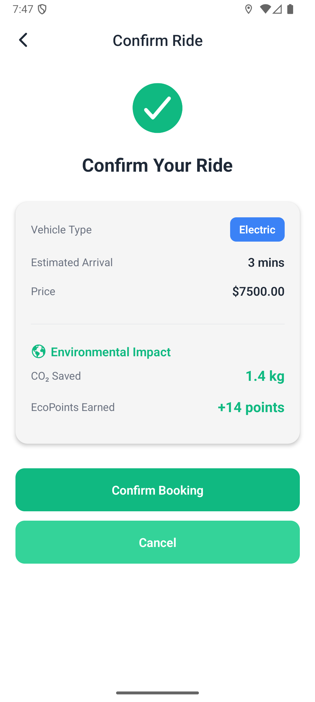
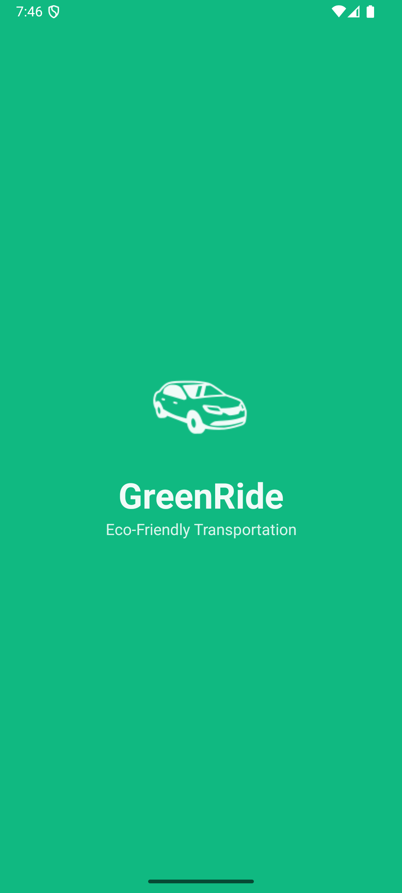
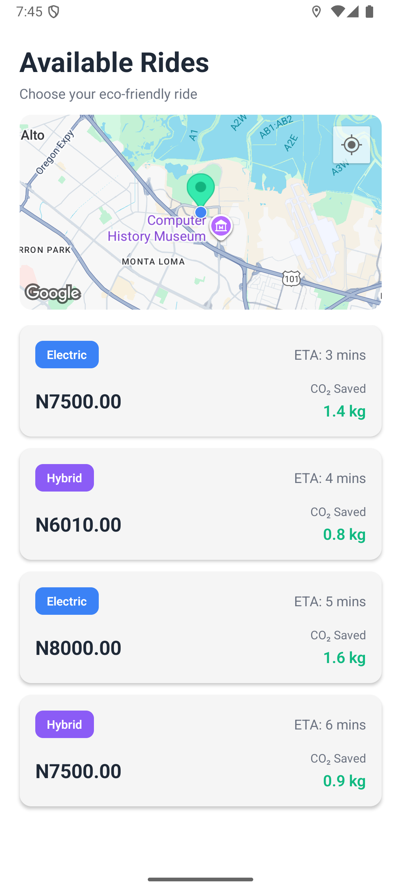
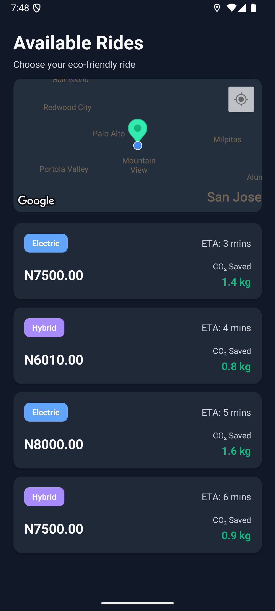
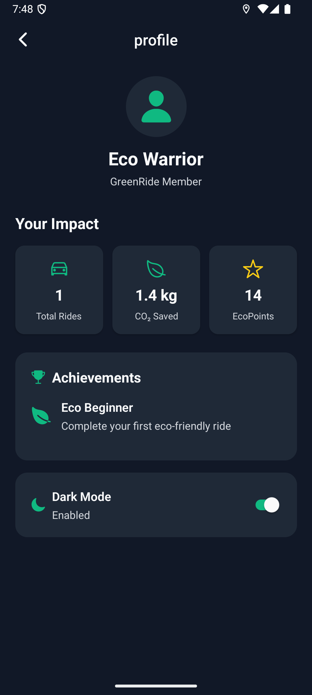

# Green Ride

**Green Ride** is an eco-friendly ride-sharing app built with **React Native + Expo**.  
It helps users book electric and hybrid rides while tracking their environmental impact — like CO₂ saved and EcoPoints earned.

## Features

- **Live Location Access** – Detects the user’s current location using `expo-location`.
- **Interactive Map** – Displays nearby eco rides on Google Maps via `react-native-maps`.
- **Ride Booking** – Allows users to choose and confirm rides easily.
- **Environmental Impact** – Tracks how much CO₂ you save and rewards you with EcoPoints.
- **Dark Mode Support** – Dynamic themes using Zustand for global state.
- **Smooth Navigation** – Powered by `expo-router`.
- **Permissions Handling** – Proper location permission handling across Android and iOS.
- **Responsive UI** – Optimized for both small and large screens.

## Tech Stack

**Framework:** [Expo](https://expo.dev/), [React Native](https://reactnative.dev/)  
**Navigation:** [expo-router](https://expo.github.io/router/)  
**State Management:** [Zustand](https://github.com/pmndrs/zustand)  
**Maps:** [react-native-maps](https://github.com/react-native-maps/react-native-maps)  
**Location:** [expo-location](https://docs.expo.dev/versions/latest/sdk/location/)  
**UI Icons:** [@expo/vector-icons](https://docs.expo.dev/guides/icons/)  
**Theme:** Custom Light/Dark Themes  
**Build:** [EAS Build](https://docs.expo.dev/build/introduction/)

## App screenshots

